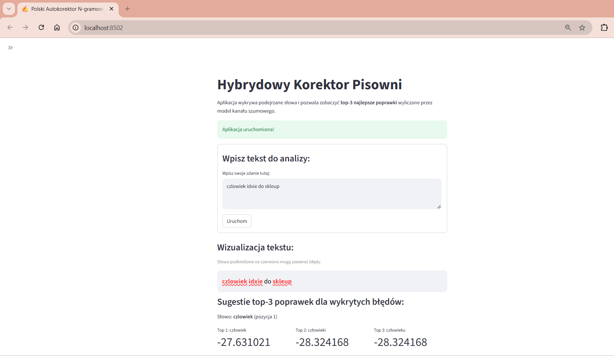
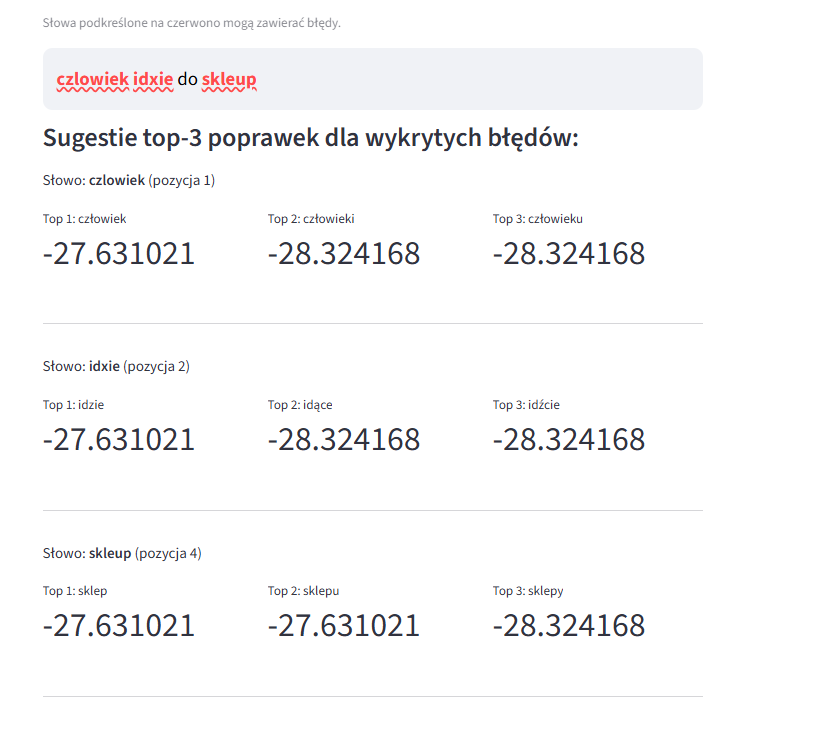

# Hybrydowy Korektor Pisowni Języka Polskiego

Link do prezentacji: https://prezi.com/view/0IsTnvXgQ2Po8h5UsOi4/?referral_token=IO2RV-lnB3FN

Celem projektu jest realizacja systemu automatycznej korekty błędów ortograficznych i literówek w języku polskim. 

### Opis problemu
System działa dwuetapowo (podejście hybrydowe) w oparciu o probabilistyczny model kanału szumowego (Noisy Channel Model):
1. **Wykrywanie i Generowanie:** Aplikacja sprawdza, czy wpisane słowa istnieją w bazie. Jeśli słowo jest błędne, specjalna struktura danych **BK-Tree (Drzewo Burkharda-Kellera)** błyskawicznie przeszukuje słownik i znajduje słowa podobne (używając odległości **Damerau-Levenshteina**, która wyłapuje błędy, takie jak zamiany sąsiednich liter miejscami, a także błędy ortograficzne).
2. **Kontekstowe Rankowanie:** Spośród podobnych słów system wybiera top-3 najlepsze poprawki. Decyzja nie zależy tylko od wyglądu słowa, ale od **kontekstu (bigramów)**. System analizuje słowo poprzedzające, oceniając (dzięki wygładzaniu Add-k), które słowo najbardziej pasuje do reszty zdania.

## Architektura Systemu
Projekt został podzielony na kilka plików zgodnie z zasadami czystości kodu:

* 'generator.py' - implementacja struktury danych Drzewa BK, która pozwala wyszukiwać słowa o niskiej odległości Damerau-Levenshteina,

* 'model_ngram.py' - pobieranie korpusu (ze strony www.wolnelektury.pl), tokenizacja, budowanie słownika i wyliczanie statystyk n-gramowych z wygładzeniem Add-k,

* 'ranker.py' - implementacja NoisyChannelRanker, który łączy prawdopodobieństwo błędu z prawdopodobieństwem językowym bigramu,

* 'app.py' - interaktywny interfejs zbudowany w Streamlit,

* 'ewaluacja.ipynb' - Jupyter Notebook zawierający analizę danych oraz wykresy

## Instrukcja uruchomienia krok po kroku

### 1. Pobranie projektu na komputer

### 2. Przygotowanie słownika SJP
Należy upewnić się, że w głównym katalogu projektu znajduje się plik `odm.txt` (oficjalny słownik odmian języka polskiego ze strony sjp.pl). Jest on niezbędny do poprawnego zainicjalizowania drzewa BK. Plik należy pobrać z tego linku: https://sjp.pl/sl/odmiany/

### 3. Instalacja wymaganych bibliotek
        pip install -r requirements.txt

### 4. Uruchomienie aplikacji Streamlit
        python -m streamlit run app.py
        
## Najważniejsze wnioski z ewaluacji

Na podstawie eksperymentów przeprowadzonych w pliku `ewaluacja.ipynb` sformułowano następujące wnioski:

* **Błędy Sztuczne vs Rzeczywiste:** System osiąga wyższą dokładność (Accuracy@1 i MRR) na błędach syntetycznych (losowych literówkach). Prawdziwe błędy ludzkie są trudniejsze do skorygowania, ponieważ często mają podłoże ortograficzne, gdzie słowa brzmią identycznie, a różnią się całkowicie zapisem graficznym – w ich przypadku kluczową rolę odgrywa rozmiar tekstu treningowego dla modelu n-gramowego.
* **Wpływ długości słowa na czas:** Czas przeszukiwania struktury BK-Tree maleje nieliniowo wraz z długością słowa wejściowego. Najwięcej słów w słowniku ma długość średnią (5–8 liter) i to dla nich system wykonuje najwięcej porównań. W przypadku słów bardzo długich (powyżej 10 liter), właściwości metryczne drzewa BK pozwalają błyskawicznie odrzucić przeważającą większość słownika o innych długościach. Komputer musi przeanalizować zaledwie ułamek procenta bazy danych, co skutkuje natychmiastowym czasem odpowiedzi dla długich wyrazów.
* **Kompromis odległości edycyjnej (Recall):** Ustawienie maksymalnej odległości edycyjnej na poziomie `max_dist=1` w dużym stopniu skraca czas działania, ale pomija trudniejsze błędy (niski Recall). Z kolei `max_dist=3` osiąga niewiele lepsze wyniki niż `max_dist=2`. Optymalnym balansem dla języka polskiego okazała się wartość `max_dist=2`.

## Screeny z działania aplikacji

Podgląd działania interfejsu użytkownika w Streamlit:

### Wizualizacja wykrywania błędów (podkreślenia)

### Panel sugerowanych poprawek top-3 wraz z punktacją logarytmiczną

